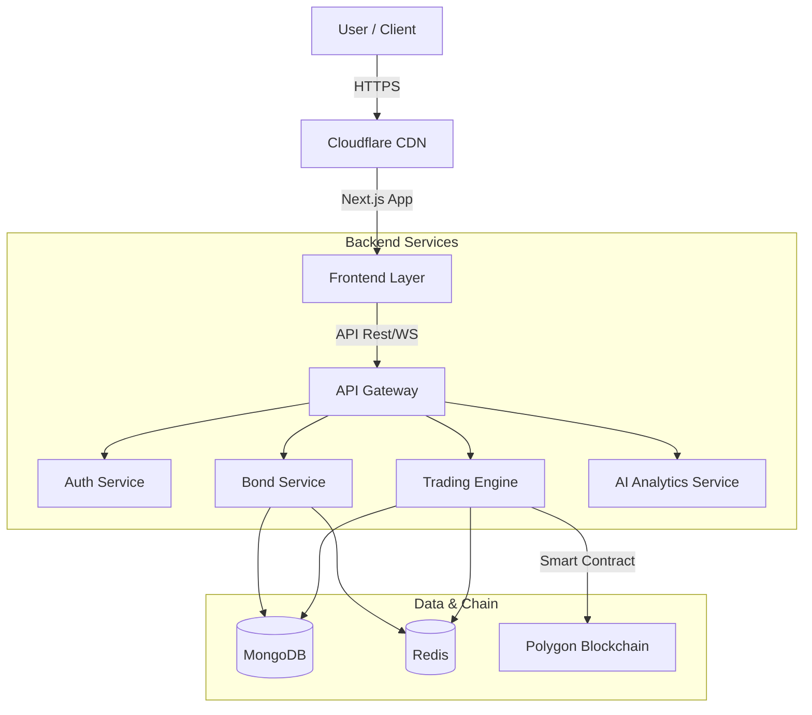

<div align="center">

  # Infrastructure Bond Tokenization Platform
  ### CIH3.0: Central India Hackathon | SDG 9.12

  **Transforming Public Infrastructure Funding through Blockchain & AI**

  [](https://nextjs.org/)
  [](https://nodejs.org/)
  [](https://www.mongodb.com/)
  [](https://www.docker.com/)
  [](https://polygon.technology/)

  <p align="center">
    <a href="#key-features">Features</a> •
    <a href="#getting-started">Getting Started</a> •
    <a href="#architecture">Architecture</a> •
    <a href="#api-documentation">API</a>
  </p>
</div>

---

## 
**"Create a platform for tokenizing infrastructure bonds to enable public-private funding."**

We address the critical gap in infrastructure financing by democratizing access to high-value assets. Our platform allows retail investors to legally own fractional shares of roads, bridges, and energy projects, fostering economic growth and innovation strictly aligned with **UN Sustainable Development Goal 9**.

---

## 

### For Investors
- **Fractional Ownership**: Buy & sell tokenized bonds starting from ₹500.
- **AI-Powered Insights**:
  - **Risk Assessment**: Real-time 0-100 risk score.
  - **Return Prediction**: LSTM-based forecasts for informed decisions.
- **e-Rupee Integration**: Seamless payments via CBDC (Digital Rupee).
- **Paper Trading**: Practice with ₹10 Lakh virtual portfolio before investing.

### For Issuers & Platform
- **Smart Contract Settlement**: Instant, trustless settlements on the Polygon network.
- **Regulatory Compliance**: Automated KYC (Aadhaar/DigiLocker) & SEBI reporting.
- **Real-time Transparency**: Immutable ledger records for every transaction.

---

## 

| Domain | Technologies |
| :--- | :--- |
| **Frontend** | Next.js 14, Tailwind CSS, Shadcn UI, Framer Motion |
| **Backend** | Node.js, Express.js, Socket.io (Real-time) |
| **Database** | MongoDB (Data), Redis (Caching) |
| **Blockchain** | Solidity, Hardhat, Ethers.js, Polygon Mumbai |
| **AI / ML** | Python microservices (LSTM, Random Forest) |
| **DevOps** | Docker, Nginx, GitHub Actions |

---

## 

Our solution utilizes an **Event-Driven Microservices Architecture** to ensure detailed scalability and reliability.



---

## 

### Prerequisites
- Node.js v18+
- Docker & Docker Compose
- MongoDB (Local or Atlas)

### Installation

1. **Clone the Repo**
   ```bash
   git clone https://github.com/Pusparaj99op/CIH3.0-SDG9.12.git
   ```

2. **Install Dependencies**
   ```bash
   cd frontend && npm install
   cd ../backend && npm install
   ```

3. **Configure Environment**
   Copy `.env.example` to `.env` and fill in your credentials:
   ```env
   MONGODB_URI=mongodb://localhost:27017/bond_platform
   JWT_SECRET=super_secret_key_cih3
   BLOCKCHAIN_NETWORK=mumbai
   ```

4. **Launch Application**
   ```bash
   # Run with Docker (Recommended)
   docker-compose up --build
   ```
   *Frontend running on: `http://localhost:3000`*
   *Backend running on: `http://localhost:3210`*

---

## 

| Method | Endpoint | Description |
| :--- | :--- | :--- |
| `GET` | `/api/v1/bonds` | List all available infrastructure bonds |
| `GET` | `/api/v1/bonds/:id/analytics` | Get AI-driven predictions for a bond |
| `POST` | `/api/v1/trading/buy` | Execute a buy order (Paper/Real) |
| `GET` | `/api/v1/portfolio` | Fetch user current holdings & PnL |

> Full Swagger documentation available at `/api-docs`

---

## 

- [x] **Phase 1**: Core Platform & Tokenization (MVP for CIH3.0)
- [ ] **Phase 2**: Mobile App (React Native) & Secondary Market
- [ ] **Phase 3**: Institutional Dashboard & Cross-chain Bridge

---

## 

| Role | Name | Link |
| :--- | :--- | :--- |
|  | **Pranay Gajbhiye** | [](https://www.linkedin.com/in/pranaygajbhiye/) |
|  | **Abhijit Dohe** | |
|  | **Vineet Mandalkar** | |
|  | **Samiksh Gupta** | |

---

<div align="center">
  <sub>Built with ❤️ for <b>Central India Hackathon 3.0</b></sub>
</div>
